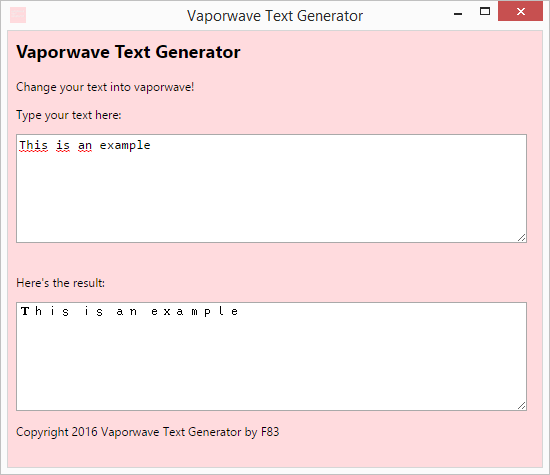

# Vaporwave Text Generator
Ｔｈｉｓ Ｃｈｒｏｍｅ ｅｘｔｅｎｓｉｏｎ ｗｉｌｌ ｇｉｖｅ ｙｏｕ ｔｈｅ ｆｅｅｌ ｏｆ ａｅｓｔｈｅｔｉｃ

## Installation

1. Download the master branch
2. Extract the zip file into a folder
3. Open chrome://extensions, enable the developer mode
4. Select "Load unpacked extension"
5. Locate the folder

## Usage

Simply click the extension icon on the right of your Chrome browser

See the image below for the usage:

